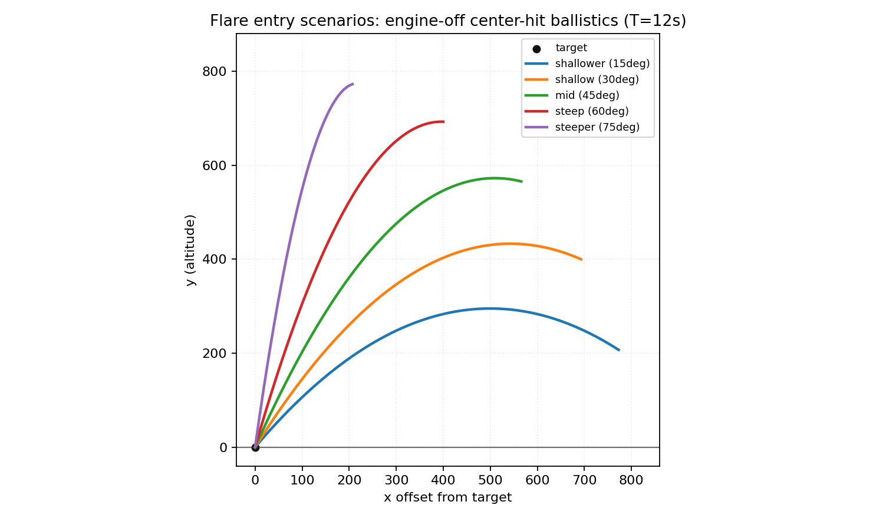

# Flare phase (`flare` level locked, bot in progress)

This page documents the stable part of flare work: the **level/scenario construction** in [`levels/flare.py`](../levels/flare.py).  
`FlareBot` behavior is under active development, so bot internals are intentionally left as a placeholder.

## Level setup (stable)

From [`levels/flare.py`](../levels/flare.py):

- Cargo: half (`2250`)
- Terrain: flat, flush/flatten target
- Target size: `110`
- Spawn geometry:
  - upper arc around target center
  - radius: `_SPAWN_RADIUS = 800`
  - angles from horizon: `15deg`, `30deg`, `45deg`, `60deg`, `75deg`
- Fixed entry timing:
  - `_TARGET_FLIGHT_TIME_S = 12.0`
- Initial velocities are solved for a center-hit engine-off entry at ~12s
- Spawn side (left/right) is deterministic from `(seed, scenario)`

Velocity solve used by the level:

- `dx = R * cos(theta)`
- `dy = R * sin(theta)`
- `vx = dx / T`
- `vy_up = ((0.5 * g * T^2) - dy) / T`

where `R = _SPAWN_RADIUS`, `T = _TARGET_FLIGHT_TIME_S`, and `g = abs(GRAVITY)`.

## Scenarios

Angle sweep scenarios:

- `shallower` (`15deg`)
- `shallow` (`30deg`)
- `mid` (`45deg`)
- `steep` (`60deg`)
- `steeper` (`75deg`)

Defaults:

- Default scenario: `mid`
- Quick benchmark subset: `shallower`, `mid`, `steeper`

## Entry trajectories (docs asset)

The plot below shows the engine-off center-hit trajectories for the 5 angle profiles (one side shown for clarity).



### Regenerate the plot

The docs plot is versioned at `docs/assets/flare_entry_ballistic_profiles.png`.  
Regenerate from the current level constants:

```bash
uv run python - <<'PY'
from pathlib import Path
import math
import matplotlib
matplotlib.use("Agg")
import matplotlib.pyplot as plt
from core.config import GRAVITY
from levels import flare as flare_level

R = float(flare_level._SPAWN_RADIUS)
T = float(flare_level._TARGET_FLIGHT_TIME_S)
profiles = tuple(flare_level._ANGLE_PROFILES)
g = abs(float(GRAVITY))
out = Path("docs/assets/flare_entry_ballistic_profiles.png")
out.parent.mkdir(parents=True, exist_ok=True)

fig, ax = plt.subplots(figsize=(9.5, 5.5), dpi=160)
ax.axhline(0.0, color="#333333", linewidth=1.0, alpha=0.7)
ax.scatter([0.0], [0.0], s=28, color="#111111", label="target")

for name, angle_deg in profiles:
    th = math.radians(float(angle_deg))
    dx = R * math.cos(th)
    dy = R * math.sin(th)
    vx = -(dx / T)
    vy = ((0.5 * g * T * T) - dy) / T
    ts = [T * i / 220.0 for i in range(221)]
    xs = [dx + vx * t for t in ts]
    ys = [dy + vy * t - 0.5 * g * t * t for t in ts]
    ax.plot(xs, ys, linewidth=2.0, label=f"{name} ({int(angle_deg)}deg)")

ax.set_aspect("equal", adjustable="box")
ax.set_xlim(-40.0, R + 60.0)
ax.set_ylim(-40.0, R + 80.0)
ax.set_xlabel("x offset from target")
ax.set_ylabel("y (altitude)")
ax.set_title(f"Flare entry scenarios: engine-off center-hit ballistics (T={T:.0f}s)")
ax.grid(True, linestyle=":", alpha=0.25)
ax.legend(loc="upper right", fontsize=8)
fig.tight_layout()
fig.savefig(out)
plt.close(fig)
PY
```

## Evaluation goals and metrics

Primary goals:

- Enter terminal control from diverse entry angles and speeds
- Converge to safe touchdown without oscillation
- Keep fuel/time reasonable while preserving stability

Useful metrics (summarized in batch mode via [`core/eval.py`](../core/eval.py)):

- Outcome: `state`, `success_rate`, `landing_offset`
- Efficiency: `fuel_consumed`, `fuel_per_distance`, `path_efficiency`
- Timing: `time`, `time_to_first_land`

## Flare bot placeholder

`FlareBot` is under active iteration and can change frequently:

- Bot code: [`bots/flare.py`](../bots/flare.py)
- Shared bot API contract: [`core/bot.py`](../core/bot.py)
- Shared drop guidance primitives: [`bots/_coast_core.py`](../bots/_coast_core.py) + [`bots/_bot_math.py`](../bots/_bot_math.py)

Stable expectations only:

- It follows the Bot sensor/action interface (`PassiveSensors` + `ActiveSensors` -> `BotAction`).
- It should keep headless stats readable for tuning runs.
- Detailed control strategy docs are deferred until the bot stabilizes.

