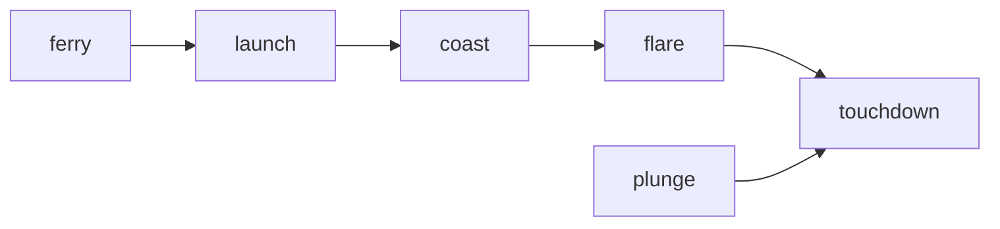

# Bot development framework

Pylander bot work is organized as a **phase-oriented pipeline**. The goal is to keep each tuning loop small, measurable, and debuggable.

## Why phases?

Complex landing behavior is easier to tune when each bot solves one job well and hands off cleanly:

- `launch`: establish a good approach trajectory and hand off to `coast`
- `coast`: run at most one flip-arc correction burn and decide when to hand off to `flare`
- `flare`: terminal 2-axis convergence and touchdown
- `plunge`: vertical-only sandbox for burn timing + touchdown (no upstream handoff required)
- `ferry`: pad-to-pad transfer wrapper (`upright clear -> launch -> coast -> flare`) with pinned destination targeting

Main chain:

`launch -> coast -> flare`

`plunge` is intentionally standalone.

`ferry` reuses the launch/coast/flare chain after an upright takeoff clear.

Ownership handoff is explicit: when a phase completes, runtime control owner switches to the next bot (not nested delegation).
The handoff also carries shared context so downstream phases keep continuity (for example pinned target UID and handoff snapshots).



## How to iterate

- Prefer headless mode for iteration:
  - `uv run python main.py <level> --headless`
- Fix `--seed` and `--scenario` while tuning one change.
- Use `--quick-benchmark` to catch regressions early (one median setup per scenario, seed `0`).
- In full batch mode, range-enabled scenarios auto-sample seeds `0-9` when `--batch-seeds` is omitted; fixed scenarios run once.

## What to measure

Most phases rely on the same run-end metrics (emitted by the game loop and summarized in batch mode):

- Outcome: `state`, `success`, `landing_offset`
- Efficiency: `fuel_consumed`, `fuel_per_distance`, `path_efficiency`
- Timing: `time`, `time_to_first_land`

Staged phases (currently `coast` and `launch`) also emit handoff/setup snapshots as `coast_handoff_*` and `launch_handoff_*`.

## Where things live

- CLI + batch evaluation: [`main.py`](../main.py)
- Game loop + raw metrics: [`game.py`](../game.py)
- Bot sensor/action API contract: [`core/bot.py`](../core/bot.py)
- Metric normalization + aggregation: [`core/eval.py`](../core/eval.py)
- Scenario levels: [`levels/`](../levels/)
- Bot implementations: [`bots/`](../bots/)
- Headless trajectory plots: [`utils/plot.py`](../utils/plot.py)

## Bot API (sensor/action)

Bots control the lander by consuming sensors and emitting explicit actions.

### Bot interface

Implement `Bot.update(dt, passive, active) -> BotAction`:

```python
from core.bot import Bot, PassiveSensors, ActiveSensors, BotAction


class MyBot(Bot):
    def update(self, dt: float, passive: PassiveSensors, active: ActiveSensors) -> BotAction:
        self.status = "idle"
        return BotAction(target_thrust=0.0, target_angle=passive.angle, refuel=False)
```

### `PassiveSensors` (snapshot)

`PassiveSensors` is a per-step snapshot:

- Position: `x`, `y`
- Terrain context: `altitude`, `terrain_y`, `terrain_slope`
- Kinematics: `vx`, `vy_up`, `ax`, `ay_up`, `angle`
- Vehicle state/resources: `mass`, `thrust_level`, `fuel`, `max_fuel`, `state`
- Contacts: `radar_contacts`, `proximity`

### `ActiveSensors` (callables)

`ActiveSensors` provides optional queries during an update:

- `raycast(dir_angle, max_range)`
- `terrain_height(world_x, lod=0)`
- `terrain_profile(x_start, x_end, samples=16, lod=0)`
- `ballistic_trajectory(x, y, vx, vy_up, ...)`

`ballistic_trajectory(...)` returns keys like:

- Hit info: `hit`, `hit_x`, `hit_y`, `hit_time`
- Impact velocities: `hit_vx`, `hit_vy_up`, `hit_speed`
- Path info: `points`, `distance`, `duration`, `termination`

### `BotAction` (outputs)

Bots emit target-style actions:

- `target_thrust`: `0..vehicle.max_thrust`
- `target_angle`: radians (`0` = upright)
- `refuel`: `True/False`
- `status`: short UI/log string
- `handoff_to`: optional next bot instance for explicit ownership transfer
- `handoff_context`: optional transferable state payload (for example pinned target UID)
- `active_bot`, `stage`: structured HUD labels (authoritative over status parsing when set)

### Notes

- Bots should use the sensor/action API, not engine internals.
- `ActiveSensors` is rebuilt per bot step and caches repeated ballistic queries within the step.
- Runtime ownership transfer applies `handoff_to`, installs the new owner in `actor_bots`, and hydrates it with `handoff_context`.
- Base hooks `export_handoff_context()` and `import_handoff_context()` provide deterministic cross-bot state carry.

